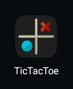

# tic_tac_toe

**A new Flutter TicTacToe project.**

## Introduction

This is a Tic Tac Toe made with Flutter without using any library or Plugins...
and I also change the name the and Icon of this project.. All the UI design are self made....

### Projects ScreenShots

**Icon**

**Main Screen**

**Playing With Bot Screen**

**Playing as Two Player**

### Live Demo

